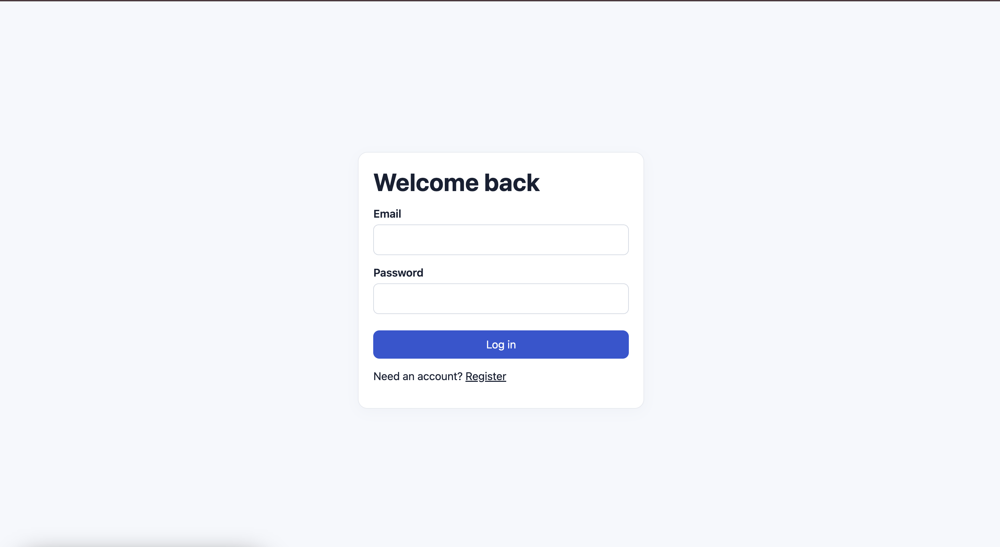
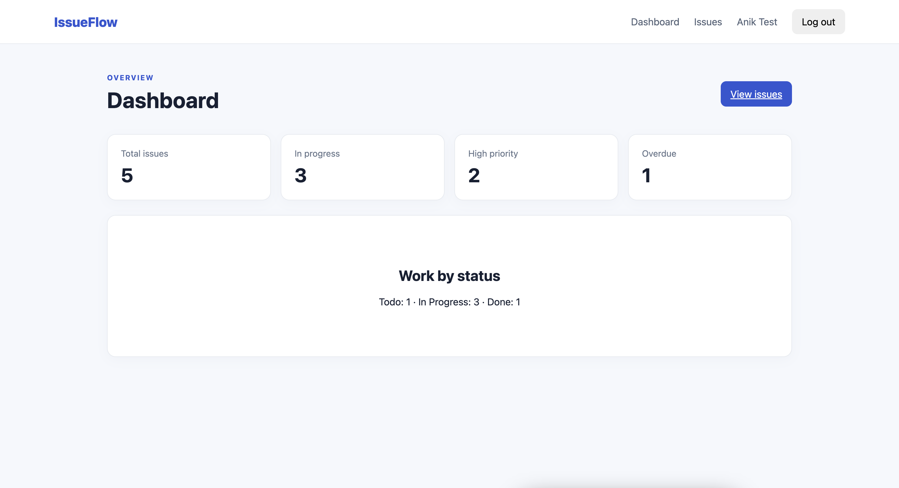
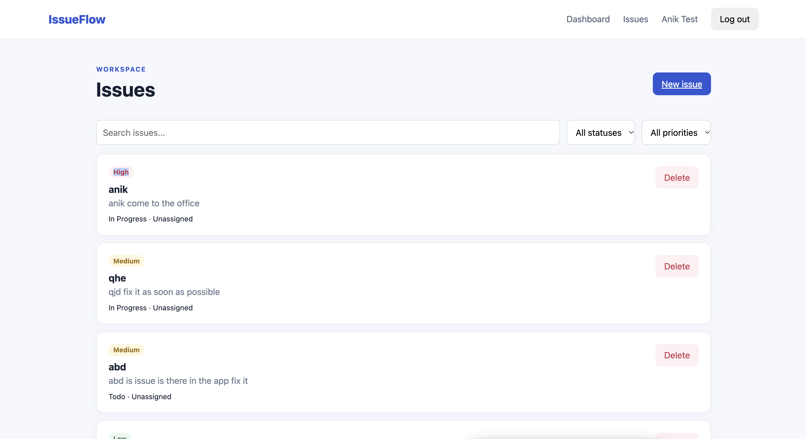
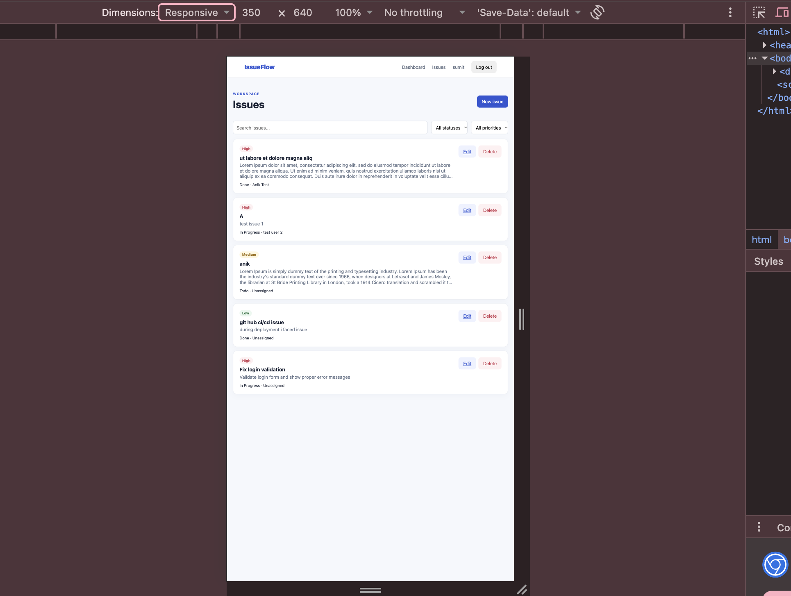

# IssueFlow

IssueFlow is a responsive MERN issue and task management application with JWT
authentication, issue CRUD, search and filtering, assignees, dashboard statistics
and MongoDB persistence.

## Screenshots

| Login | Dashboard |
|---|---|
|  |  |

| Issues | Mobile |
|---|---|
|  |  |

## Features

- Register and log in with JWT authentication (stored in an HTTP-only cookie)
- Create, view, edit and delete issues (deleting asks for confirmation)
- Issue fields: title, description, status, priority, assignee, due date
- Assign an issue to a registered user with a searchable assignee field
- Case-insensitive partial search on title and description, plus status and priority filters, sorting and pagination
- Dashboard with issue statistics
- Validation on the API and in the form: title is required (max 120 characters), description max 2000 characters
- Responsive layout for mobile and desktop

## Technologies Used

- **Frontend:** React, Vite
- **Backend:** Node.js 20+, Express.js, Zod (request validation)
- **Database:** MongoDB with Mongoose
- **Authentication:** JWT in HTTP-only cookies
- **Tooling:** ESLint, Vitest

## Setup and installation

1. Install Node.js 20+ and MongoDB, and start the MongoDB service.
2. From the repository root, install dependencies:
   `npm install && npm install --prefix backend && npm install --prefix frontend`
3. Copy `backend/.env.example` to `backend/.env` and `frontend/.env.example` to `frontend/.env`.
4. Set a strong random `JWT_SECRET` in `backend/.env` (for example, run `openssl rand -hex 32`). Keep the default local `MONGODB_URI` unless MongoDB runs elsewhere.

## How to run

Start the API and the client together:

```bash
npm run dev
```

The API runs on `http://localhost:5001` and the Vite client on `http://localhost:5173`.
Never commit `.env` files or real credentials.

## Testing

```bash
npm run lint
npm run test
npm run build
```

Backend tests cover the health check, issue search (partial match, case insensitivity,
special characters) and length validation. The frontend currently has only a minimal
smoke test.

## API overview

Authentication endpoints: `/api/v1/auth/register`, `/api/v1/auth/login`,
`/api/v1/auth/logout` and `/api/v1/auth/me`. Authenticated clients can manage issues
through `/api/v1/issues`, read statistics from `/api/v1/dashboard/stats`, and search
assignable users through `/api/v1/users`. The session JWT is stored in an HTTP-only
cookie, so browser clients must send credentials with requests.

Issue list requests support `search`, `status`, `priority`, `sort`, `order`, `page` and `limit`.
In production, use a long random JWT secret, HTTPS, a specific client origin and a managed
MongoDB deployment.

## AI-Assisted Development

**Tool used:** Code0 (CodeZero) VS Code extension, with the GitHub Copilot CLI as the AI agent.

I used Code0's plan-first workflow: the agent first produced a plan with no code changes,
I reviewed and approved it, and then it implemented one task at a time.

### Tasks where I used it

1. **Project scaffolding:** planned the architecture, then generated the frontend and backend structure.
2. **API creation:** JWT auth, protected routes, issue CRUD, dashboard statistics, filtering and search.
3. **React components:** pages and a shared `IssueForm` used for both creating and editing issues.
4. **Debugging:** fixed JSX parsing errors in `IssuesPage.jsx` and the Express error handler (it must have 4 arguments to be treated as an error handler).
5. **Dependencies and verification:** replaced a vulnerable `concurrently` package with a small Node dev runner, upgraded Vite and Vitest, and moved the API from port 5000 to 5001 because macOS uses 5000.

### Problems I found by testing manually, and fixed with the tool

| Problem | Fix |
|---|---|
| No way to edit an existing issue | Added an edit route and Edit button, reusing `IssueForm` |
| Assignee field missing from the form | Added a searchable assignee field with request cancellation |
| Delete happened without confirmation | Added a confirmation step |
| Search matched only whole words | Replaced text search with an escaped, case-insensitive regex, and added tests |
| No length limits on title and description | Added limits in the Zod schema, the Mongoose model and the form, with tests |
| Long descriptions and narrow screens hurt the mobile layout | CSS polish, with descriptions clamped to 3 lines |

### Tool setup problem

Code0 could not find an AI provider at first, and its tool connection failed with Codex.
I installed the Copilot CLI, logged in and switched the agent to Copilot.

## Known limitations

- Search uses a regex, which is fine for small data. A text index or Atlas Search would suit larger data.
- Frontend test coverage is minimal.
- The app is not deployed.